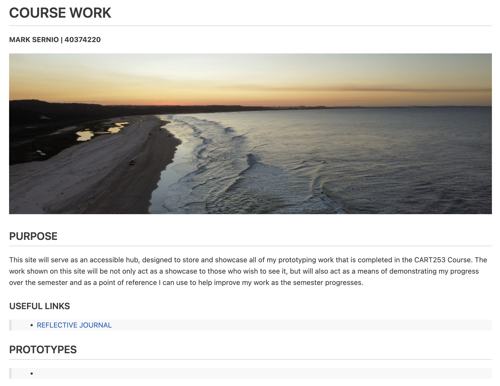
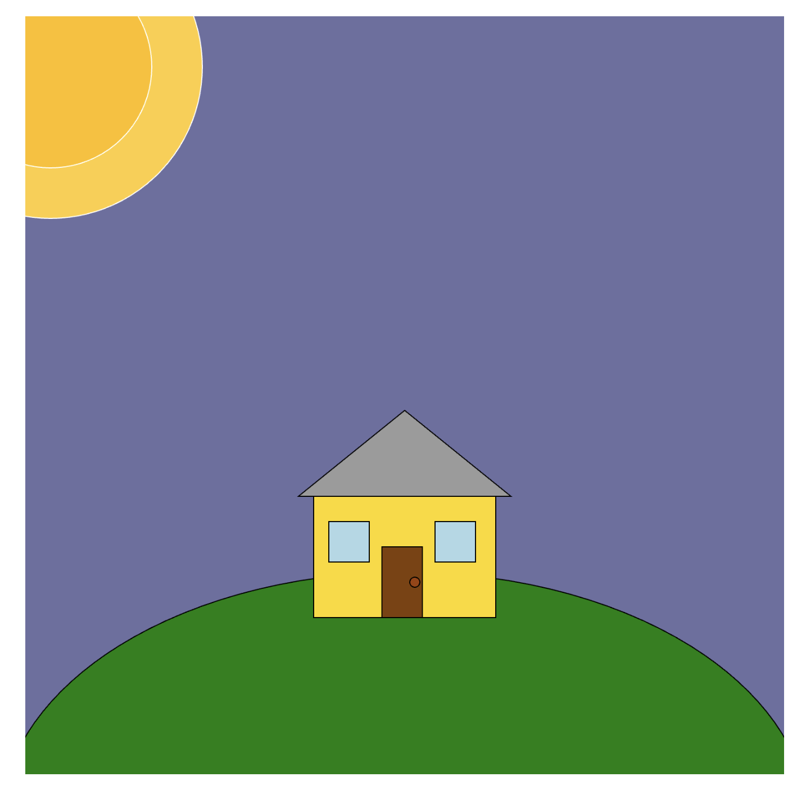
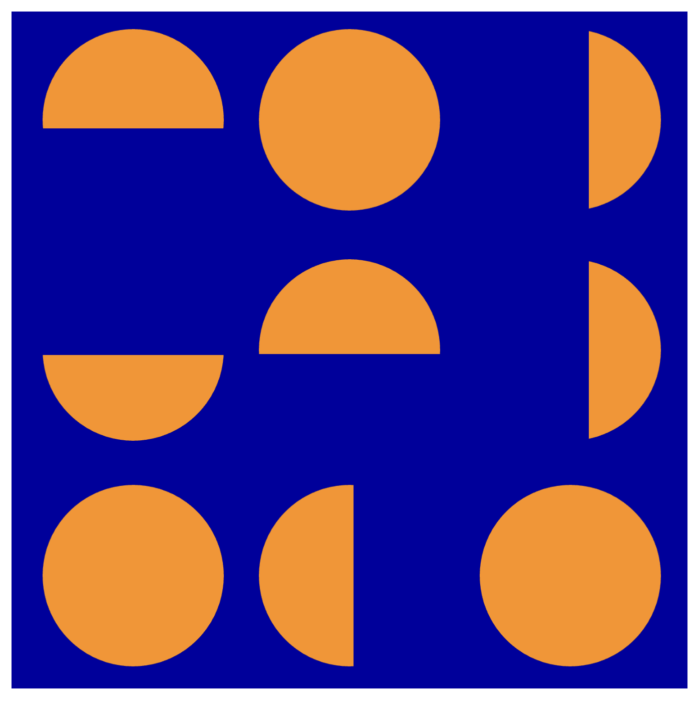

# REFLECTIVE JOURNAL

### WEDNESDAY | SETPEMBER 16, 2026
This excercise was the first time I have ever used Markdown. Previously I have used Github, HTML and a bit of JS at my Univsierty back home in Australia, however learning something like Markdown was a great way to get further versed in the world of coding. 

Some things I learned include:
> 1. Structuring a page
> 2. Writing headings in various forms H1, H2, H3
> 3. Bolding and italicising text
> 4. Linking Images and sheets
> 5. Lists (ordered and unordered)
> 6. Setting up an MD sheet in Github

I found this was a great experiment as it furthered my knowledge of Github aswell as Markdown. One thing that surprised me about Markdown was how easy and quick it was to learn (with the cheat sheet). Given how coding can be quite tedious and precise, I was expecting the same for Markdown but I didn't find this. I think that's also a cool aspect of it too, as it makes not only Markdown more accessible to all, but it also helps Github become less intimidtating. That being said, the  thing that I found most difficult was just setting it up in Github for the first time, and configuring an MD sheet, etc. 

When it comes to my work, I aspire to create work that helps people and makes their lives easier, or fun too! I want future audiences to connect with and utlisie my work in the highest capacities.

**Include at least one screenshot (probably just of your website, just for practice).**

### WEDNESDAY | SETPEMBER 23, 2026
This excercise was one that I found great for developing my knowledge, however I just feel that I didn't produce technically proficient work compared to what level I think we should be at.

Considering we were to use the knowledge we learnt in class and try not to advance too much further, I found completing these prototypes more of an excerise on my design process and how to get creative with the producing designs off basic code learnt. That being said, it was great to repetitavely use the code so that I learnt it more.

I think one thing I found most confusing was the PI functon for rotating the Ellipse's. My goal going forward is to continue to develop my knowledge and start exploring more with P5 and learning some other functions that differ from or extend on what we learnt in class. 

Screenshots of Prototypes:

